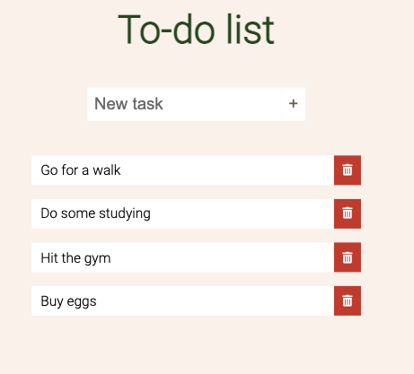

## TODO list

Middels deze TODO app is het mogelijk om een lijst samen te stellen van taken en die na afronding weer te verwijderen.

### Project doel

Het doel van het project is om een TODO lijst (gekoppeld aan een RESTful API) te bouwen in Vanilla JavaScript.

### Project eisen

- [x] Als gebruiker wil ik een inputveld zien waarin ik mijn taak in kan vullen.
- [x] Als gebruiker kan ik op een button drukken met de tekst "Add Task" waardoor je ingevulde taak toegevoegd wordt aan de lijst.
- [x] Als gebruiker zie ik wanneer ik op de add button knop heb geklikt, de taak verschijnen in mijn takenlijst.
- [x] Taak verwijderen: Als gebruiker kan ik in de takenlijst op een icoontje klikken van een prullenbak, rechts naast de taak, waardoor de taak uit mijn takenlijst wordt verwijderd.

### API eisen

- [x] GET: Verkrijg de (initiële) lijst met taken van de database.
- [x] POST: Update de takenlijst met 1 nieuwe taak. Stuur alleen {description: "blah", done: false}
- [x] DELETE: Verwijder een taak uit de database. Gebruik de id die je terugkrijgt als identifier.
- [x] Maak een file genaamd api-client.js zoals je hebt geleerd in de afgelopen tijd voor al je requests.
